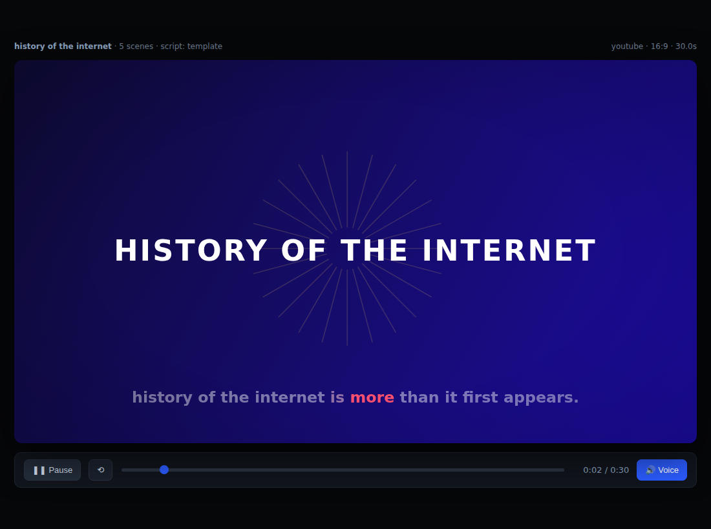

# montage-mini

**A tiny, offline, agentic video-production pipeline** — a miniature homage to
[OpenMontage](https://github.com/calesthio/OpenMontage), built to run anywhere
Python runs, with **zero API keys, no FFmpeg, no GPU**.

You describe a video in plain language; montage-mini runs a structured pipeline
— `brief → script → scene_plan → assets → compose → review` — and renders a
**self-contained HTML "video"** you can open in any browser.



*A frame from a zero-key render: gradient background, "burst" motif, kinetic
headline, and word-level captions highlighting in sync.*

---

## Why this exists

The full OpenMontage system needs Python + Node/Remotion + FFmpeg + a stack of
media-provider API keys, and general internet access to fetch assets and call
models. In a locked-down sandbox (no FFmpeg, egress limited to package
registries) none of that is reachable.

montage-mini keeps OpenMontage's **shape** — pipeline-driven, manifest + stage
skill + discrete tools, scored/auditable decisions, quality gates — but shrinks
the runtime to the standard library and swaps the unreachable pieces for
offline equivalents:

| OpenMontage | montage-mini (offline) |
|---|---|
| FLUX / Veo image & video generation | **synthesized vector scenes** (gradient + motif + Ken Burns), computed from a style playbook |
| Remotion / FFmpeg render | a **self-contained HTML canvas player** |
| Piper / ElevenLabs TTS | the browser's built-in **SpeechSynthesis** (offline) |
| Live web research + LLM scripting | **optional** Anthropic scriptwriter, with a deterministic template fallback |
| ffprobe post-render review | **plan-level quality gates** (completeness, caption bounds, duration, slideshow risk) |

It is intentionally small (~6 source files, stdlib only). It is *not* a
replacement for OpenMontage — it's a runnable, inspectable sketch of the same
idea.

---

## Quick start

```bash
cd montage-mini

python3 montage.py "Make a 45-second animated explainer about why the sky is blue"
# → writes projects/<slug>/final.html  — open it in a browser

# pick a platform / tone / length right in the prompt:
python3 montage.py "Create a 60s cinematic trailer about Mars colonization, vertical, no narration"
python3 montage.py "90 second documentary montage about city life at 4am, elegiac tone"

make demo     # render a zero-key demo into demos/
make test     # run the offline self-tests
```

No dependencies are required. The only optional one is `anthropic` (below).

### Optional: LLM-authored scripts

The **template** scriptwriter always runs and produces a structurally-complete
scaffold offline. If you want a *grounded, factual* script instead, make the
Anthropic SDK importable and provide credentials:

```bash
pip install anthropic
export ANTHROPIC_API_KEY=...        # or run `ant auth login`
# optional: export MONTAGE_LLM_MODEL=claude-opus-4-8
python3 montage.py "Explain how CRISPR works, 60s"
```

The pipeline auto-detects this and the decision log will show
`script: llm backend`. If credentials or the network are unavailable it falls
back to the template silently — the video still renders.

---

## How it works

```
You: "Make an explainer about how black holes form"
 │
 ▼  brief        parse topic / duration / profile / tone / narration
 ▼  script       title + one beat per scene (LLM or template)
 ▼  scene_plan   per-scene durations + word-level caption timings
 ▼  assets       synthesize a vector visual per scene from the style playbook
 ▼  compose      render a self-contained HTML canvas player
 ▼  review       quality gates (gate — surfaced, never swallowed)
 ▼
projects/<slug>/final.html        the playable video
                production.json   the composed plan (validates against schemas/)
                checkpoint.json    brief + decision log + review report
```

There is no orchestrator "engine" — each stage is a small, readable function,
and every choice is appended to a **decision log** you can inspect in
`checkpoint.json` and in the CLI output.

## Layout

```
montage-mini/
├── montage.py                  # CLI entrypoint / orchestrator
├── montagemini/                # the tools (the pipeline's hands)
│   ├── brief.py                #   parse the request
│   ├── styles.py               #   visual style playbooks (palette/font/motion)
│   ├── script.py               #   scriptwriter (LLM + template backends)
│   ├── sceneplan.py            #   timing + word-level captions
│   ├── assets.py               #   synthesize vector scene visuals
│   ├── compose.py              #   render the self-contained HTML player
│   ├── review.py               #   quality gates
│   └── pipeline.py             #   wire the stages + decision log
├── pipeline_defs/
│   └── animated_explainer.json # pipeline manifest (stages, tools, success gates)
├── skills/
│   └── animated_explainer.md   # stage-director skill (how to run each stage)
├── schemas/
│   └── production.schema.json  # contract for production.json
└── test_pipeline.py            # offline self-tests
```

## Limitations (stated plainly)

- The output is an **HTML video**, not an `.mp4`. Making a real video file
  needs FFmpeg, which isn't available in this environment. You can screen-record
  the HTML, or wire FFmpeg in yourself where it exists.
- The **template** scriptwriter writes *structure*, not researched facts. Use
  the optional LLM backend (or edit the script) for real content.
- Visuals are synthesized vector scenes, not photographic/AI imagery.

## License

Provided as-is, for learning and tinkering. OpenMontage itself is AGPL-3.0;
this is an independent, much smaller homage and shares no code with it.
